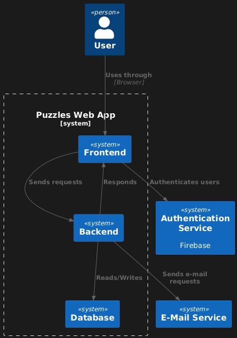

# Design Specification

## 1. INTRODUCTION
The purpose of this document is to provide a detailed design specification for the Puzzles project. This includes the architecture, components, low-level designs, and diagrams to guide the implementation phase. The document is organized into system architecture and low-level design sections.

## 2. SYSTEM ARCHITECTURE

### 2.1 System Architecture
The system is divided into the following key components:

1. **Frontend**:
   - Responsible for user interface (UI) and interactions.
   - Implements pages such as the landing page, login, puzzle-solving interface, leaderboard, and profile page.

2. **Backend**:
   - Handles business logic, user identification, puzzle management, and leaderboard updates.
   - Exposes REST APIs for frontend interactions.

3. **Database**:
   - Stores user data, available puzzles, solved puzzles and leaderboard rankings.
   - Uses a relational database for structured data.

4. **Services**:
   - **User Service**: Tracks identified users and profile management.
   - **Authentication Service (FOREIGN)**: Allows for easy user registration, authentication, and profile management.
   - **Puzzle Service**: Handles puzzle fetching, validation, and completion recording.
   - **Leaderboard Service**: Updates and retrieves (filtered) leaderboard data.
   - **E-Mail Service (FOREIGN)**: Notifies users when a new record is broken in the leaderboard

### 2.2 Component (Package) Diagram
Below is a description of the inputs, outputs, and services of each component:

- **Frontend**:
  - **Inputs**: User interactions like puzzle selection, solving etc..
  - **Outputs**: Rendered pages, user feedback, and leaderboard updates.
  - **Services**: Consumes REST APIs for all functionalities.

- **Backend**:
  - **Inputs**: API requests from the frontend.
  - **Outputs**: JSON responses with data (e.g., puzzle details, user progress).
  - **Services**: Exposes endpoints for authentication, puzzle handling, and leaderboard management.

- **Database**:
  - **Inputs**: Insert, update, and delete queries from the backend.
  - **Outputs**: Query results (e.g., user data, leaderboard rankings).
  - **Services**: Provides structured and semi-structured data storage.

## 3. LOW LEVEL DESIGN

### 3.1 Class Diagrams

UserService
- getProfileData()
- getUserByFirebaseID()
- getPuzzleEntriesByUserId()
- createUser()

UserRepository
- saveUser()
- getUserByEmail()
- getUserById()
- getUserByFirebaseID()

PuzzleService
- getRandomPuzzle()
- getPuzzleById()
- validateSolution()
- submitNewEntry()

PuzzleRepository
- getRandomPuzzle()
- getPuzzleById()

LeaderboardService
- getLeaderboardByDifficulty()
- getLeaderboardByUserId()
- submitNewEntry()

PuzzleEntryRepository
- submitNewEntry()
- getEntriesByDifficulty()
- getEntriesByUserId()

### 3.2 Sequence Diagrams

#### User Registration
1. User submits registration details.
2. User data is validated by Firebase Authentication
3. Appropriate user identfier is passed to the backend and saved
4. Confirmation is sent to the frontend.

#### Puzzle Solving
1. User selects a puzzle.
2. Puzzle data is fetched and displayed.
3. User submits a solution.
4. Backend validates the solution.
5. Leaderboard is updated, and feedback is returned.

#### Viewing the Leaderboard
1. User enters the leaderboard page
2. User selects specific leaderboard (easy/medium/hard)
3. Necessary leaderboard data is fetched
4. Leaderboard is displayed, user is highlighted

### 3.3 Data Flow Diagram (DFD)

#### Level 0

##### External Entities:
- **Users**: The end-users who interact with the platform to register, solve puzzles, and check their standings on the leaderboard.
- **Database**: Represents the data storage for the platform (e.g., user information, puzzle data, leaderboard entries).

##### Data Flows:
- **Users to System**:
  - Registration/Login details.
  - Puzzle solutions and interactions.
  - Requests for leaderboard or profile data.
- **System to Users**:
  - Response to login or registration attempts.
  - Puzzle data for display.
  - Updated leaderboard or profile information.
- **System to Database**:
  - Stores user credentials and puzzle completion data.
  - Retrieves leaderboard rankings and puzzle metadata.
- **Database to System**:
  - Provides data needed for user requests.

#### Level 1

##### Processes:
- **User Management**:  
  Handles user-related activities such as:
  - Registration (stores name, email, password hash).
  - Login (validates credentials).
  - Profile updates.
- **Puzzle Management**:
  - Retrieves puzzle data.
  - Validates puzzle solutions.
  - Updates puzzle completion records.
- **Leaderboard Management**:
  - Retrieves leaderboard rankings for specific puzzles.
  - Updates rankings when new completions are logged.

##### Data Stores:
- **User Data Store**: Stores user information.
- **Puzzle Data Store**: Contains puzzle details.
- **Leaderboard Data Store**: Stores rankings and completion times for puzzles.

#### Level 2

##### Step 1: Puzzle Selection
- The user selects a puzzle from a list displayed on the platform.
- The system queries the Puzzle Data Store to fetch puzzle data and displays it to the user.

##### Step 2: Solution Submission
- The user submits a solution to the selected puzzle.
- The system validates the solution:
  - Ensures the user completed the puzzle within allowed parameters (e.g., time limits, no duplication).

##### Step 3: Update Records
- If the solution is valid, the system:
  - Logs the completion in the `PuzzlesCompleted` Data Store (records `user_id`, `puzzle_id`, `time_taken`, and `completed_at` timestamp).
  - Updates the `Leaderboard` Data Store for the puzzle:
    - Recalculates rankings based on the new completion time.
    - Saves the updated rankings.

##### Step 4: Leaderboard Retrieval
- The updated leaderboard is retrieved from the Leaderboard Data Store.
- The system formats the leaderboard data and sends it to the user interface.

##### Step 5: Response to User
- The user sees the leaderboard, including their rank, time, and comparison with others.

