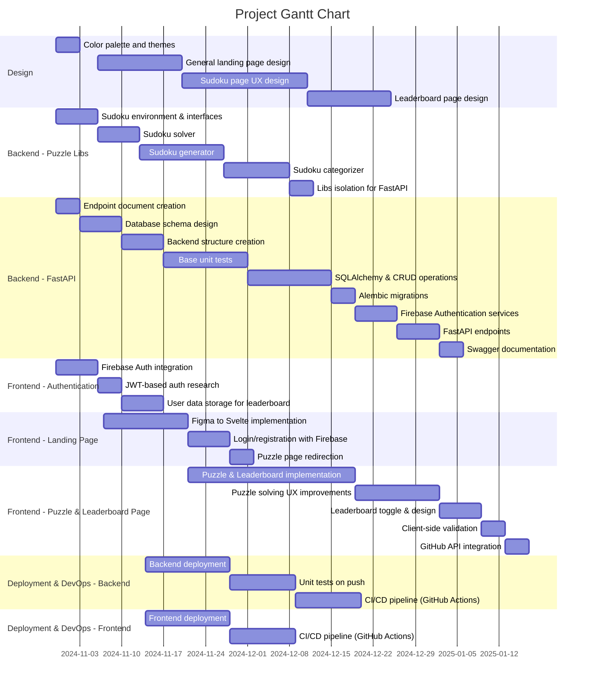

```mermaid
gantt
    title Project Gantt Chart

    %% Define time units (weeks)
    dateFormat  YYYY-MM-DD
    section Design
    Color palette and themes              :des1, 2024-10-30, 0.5w
    General landing page design           :des2, 2024-11-06, 2w
    Sudoku page UX design                 :des3, 2024-11-20, 3w
    Leaderboard page design               :des4, 2024-12-11, 2w

    section Backend - Puzzle Libs
    Sudoku environment & interfaces       :lib1, 2024-10-30, 1w
    Sudoku solver                         :lib2, after lib1, 1w
    Sudoku generator                      :lib3, after lib2, 2w
    Sudoku categorizer                    :lib4, after lib3, 1.5w
    Libs isolation for FastAPI            :lib5, after lib4, 0.5w

    section Backend - FastAPI
    Endpoint document creation            :api1, 2024-10-30, 0.5w
    Database schema design                :api2, after api1, 1w
    Backend structure creation            :api3, after api2, 1w
    Base unit tests                       :api4, after api3, 2w
    SQLAlchemy & CRUD operations          :api5, after api4, 2w
    Alembic migrations                    :api6, after api5, 0.5w
    Firebase Authentication services      :api7, after api6, 1w
    FastAPI endpoints                     :api8, after api7, 1w
    Swagger documentation                 :api9, after api8, 0.5w

    section Frontend - Authentication
    Firebase Auth integration             :auth1, 2024-10-30, 1w
    JWT-based auth research               :auth2, after auth1, 0.5w
    User data storage for leaderboard     :auth3, after auth2, 1w

    section Frontend - Landing Page
    Figma to Svelte implementation        :lp1, 2024-11-7, 2w
    Login/registration with Firebase      :lp2, after lp1, 1w
    Puzzle page redirection               :lp3, after lp2, 0.5w

    section Frontend - Puzzle & Leaderboard Page
    Puzzle & Leaderboard implementation   :pl1, 2024-11-21, 4w
    Puzzle solving UX improvements        :pl2, after pl1, 2w
    Leaderboard toggle & design           :pl3, after pl2, 1w
    Client-side validation                :pl4, after pl3, 0.5w
    GitHub API integration                :pl5, after pl4, 0.5w

    section Deployment & DevOps - Backend
    Backend deployment                    :dev1, 2024-11-14, 2w
    Unit tests on push                    :dev2, after dev1, 1.5w
    CI/CD pipeline (GitHub Actions)       :dev3, after dev2, 1.5w

    section Deployment & DevOps - Frontend
    Frontend deployment                   :dev4, 2024-11-14, 2w
    CI/CD pipeline (GitHub Actions)       :dev5, after dev4, 1.5w
```