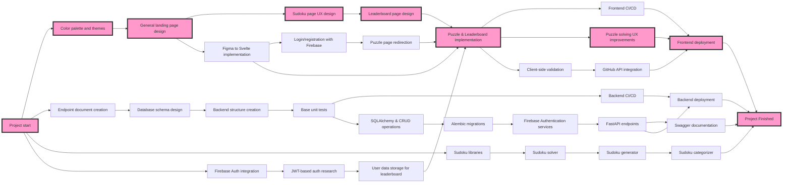

```mermaid
flowchart LR
    %% Project Start
    projstart[Project start]
    projstart --> des1
    projstart --> api1
    projstart --> lib1
    projstart --> auth1

    %% Design Phase
    des1[Color palette and themes] --> des2[General landing page design]
    des2 --> des3[Sudoku page UX design]
    des3 --> des4[Leaderboard page design]
    des4 --> pl1

    %% Backend - Puzzle Libs Phase
    lib1[Sudoku libraries]
    lib2[Sudoku solver]
    lib3[Sudoku generator]
    lib4[Sudoku categorizer]
    lib1 --> lib2
    lib2 --> lib3
    lib3 --> lib4
    lib4 --> endproj

    %% Backend - FastAPI Phase
    api1[Endpoint document creation] --> api2[Database schema design]
    api2 --> api3[Backend structure creation]
    api3 --> api4[Base unit tests]
    api4 --> bcicd[Backend CI/CD]
    bcicd --> dev1
    api4 --> api5[SQLAlchemy & CRUD operations]
    api5 --> api6[Alembic migrations]
    api6 --> api7[Firebase Authentication services]
    api7 --> api8[FastAPI endpoints]
    api8 --> api9[Swagger documentation]
    api9 --> endproj

    %% Frontend - Authentication Phase
    auth1[Firebase Auth integration]
    auth1 --> auth2[JWT-based auth research]
    auth2 --> auth3[User data storage for leaderboard]
    auth3 --> pl1

    %% Frontend - Landing Page Phase
    des2 --> lp1[Figma to Svelte implementation]
    lp1 --> lp2[Login/registration with Firebase]
    lp2 --> lp3[Puzzle page redirection]
    lp3 --> pl1

    %% Frontend - Puzzle & Leaderboard Page Phase
    lp1 --> pl1[Puzzle & Leaderboard implementation]
    pl1 --> fcicd[Frontend CI/CD]
    pl1 --> pl2[Puzzle solving UX improvements]
    pl2 --> dev4
    pl1 --> pl4[Client-side validation]
    pl4 --> pl5[GitHub API integration]
    fcicd --> dev4
    dev4 --> endproj

    %% Deployment & DevOps - Backend Phase
    api8 --> dev1[Backend deployment]
    dev1 --> endproj

    %% Deployment & DevOps - Frontend Phase
    pl5 --> dev4[Frontend deployment]

    endproj[Project Finished]

    %% Longest path styling
    style projstart fill:#f9c,stroke:#333,stroke-width:4px
    style des1 fill:#f9c,stroke:#333,stroke-width:4px
    style des2 fill:#f9c,stroke:#333,stroke-width:4px
    style des3 fill:#f9c,stroke:#333,stroke-width:4px
    style des4 fill:#f9c,stroke:#333,stroke-width:4px
    style pl1 fill:#f9c,stroke:#333,stroke-width:4px
    style pl2 fill:#f9c,stroke:#333,stroke-width:4px
    style dev4 fill:#f9c,stroke:#333,stroke-width:4px
    style endproj fill:#f9c,stroke:#333,stroke-width:4px
```
