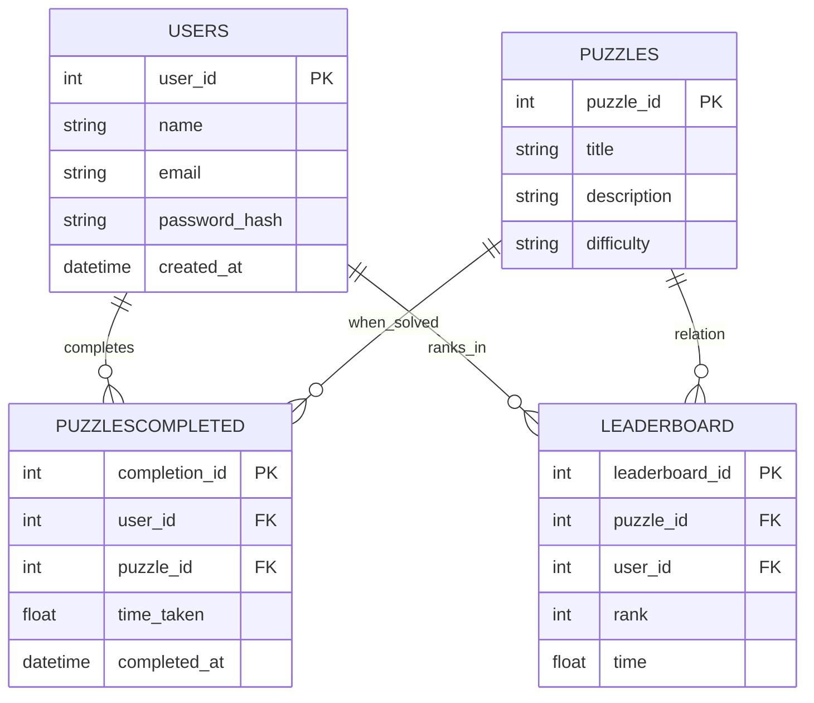

```mermaid
erDiagram
    USERS {
        int user_id PK
        string name
        string email
        string password_hash
        datetime created_at
    }
    PUZZLES {
        int puzzle_id PK
        string title
        string description
        string difficulty
    }
    PUZZLESCOMPLETED {
        int completion_id PK
        int user_id FK
        int puzzle_id FK
        float time_taken
        datetime completed_at
    }
    LEADERBOARD {
        int leaderboard_id PK
        int puzzle_id FK
        int user_id FK
        int rank
        float time
    }

    USERS ||--o{ PUZZLESCOMPLETED : completes
    PUZZLES ||--o{ PUZZLESCOMPLETED : when_solved
    USERS ||--o{ LEADERBOARD : ranks_in
    PUZZLES ||--o{ LEADERBOARD : relation

```
