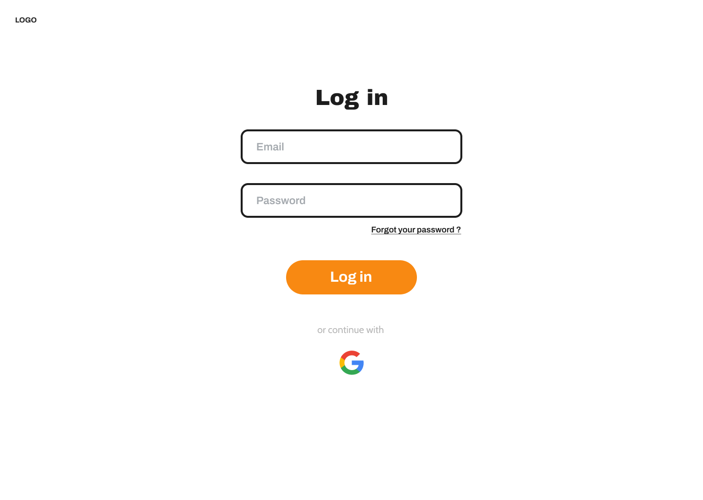
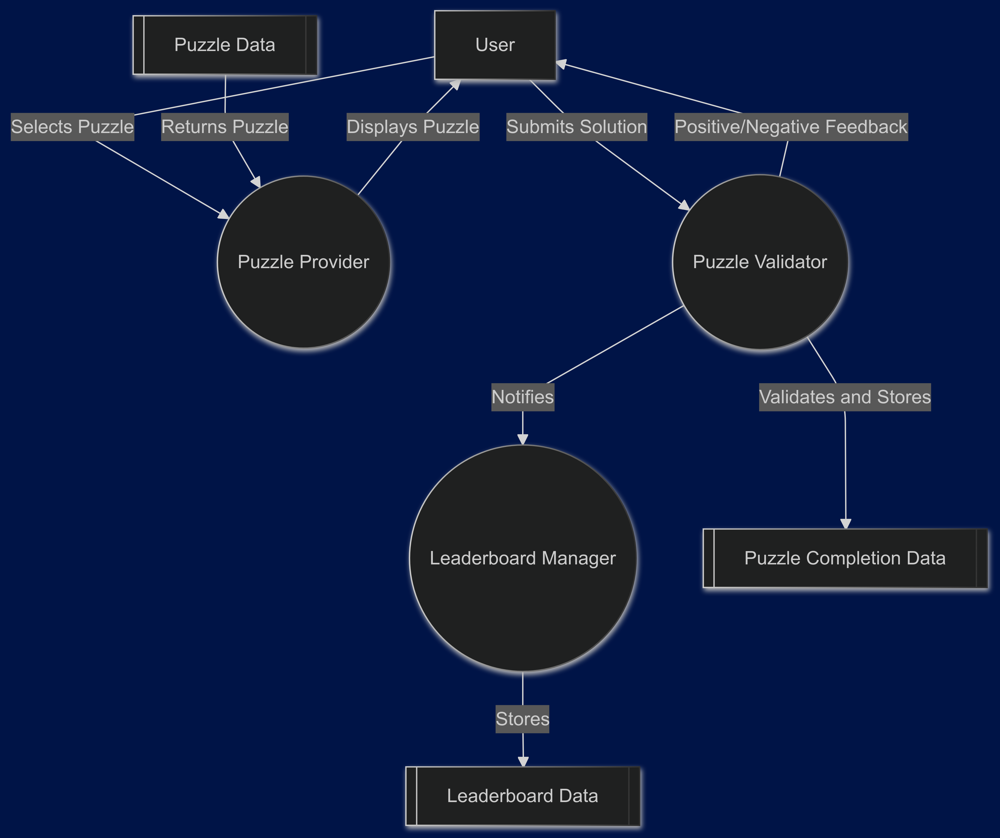

# Software Requirements Specification (SRS)

## 1. INTRODUCTION

### Goal
The purpose of this document is to outline the functional and non-functional requirements for a puzzle-solving website. This platform is designed to engage users in solving puzzles, tracking their progress, and interacting with other users through a leaderboard and profile features.

### Contents and Organization
The document is structured as follows:
- System Requirements: Lists both functional and non-functional requirements.
- Use Cases: Outlines the various types of users, scenarios, and use cases, with diagrams illustrating the flow of actions within the system.

## 2. SYSTEM REQUIREMENTS

### Functional Requirements

1. **User Registration and Authentication**
   - The system will provide secure user registration, including a unique email requirement.
   - Users will have access to secure login, logout

2. **Puzzle Display and Solving**
   - Users can view puzzles and select their preferred difficulty level.
   - A timer will start with the puzzle, enabling competitive gameplay on leaderboards.
   - Users will be able to submit solutions to the leaderboard.

3. **Leaderboard and User Progress Tracking**
   - The platform will rank users on a leaderboard based on times achieved in puzzle-solving.
   - Users can view their scores and progress in the profile panel.
   - Scores and rankings will be updated in real-time based on solved puzzles and recorded times.

4. **Profile Panel**
   - Users can track their progress and view past performance.
   - The profile page will display completed puzzles and times, along with current rankings.

### Non-Functional Requirements

1. **Performance**  
   - The system should maintain page load times under 2 seconds under typical load.

2. **Security**  
   - Sensitive data, including passwords, will be encrypted. All sensitive actions (e.g., login, registration) will use HTTPS.

3. **Usability**  
   - The interface should be user-friendly and accessible on both desktop and mobile devices.

4. **Reliability**  
   - The platform aims for 99.9% uptime.

## 3. USE CASES

### 3.1 User Types

1. **Visitor**  
   - Can view available puzzles, view the leaderboard, and register for an account.

2. **Registered User**  
   - Can log in, solve puzzles, track progress, view the leaderboard, and update personal information.

### 3.2 User Scenarios

1. **Persona: Rümeysa, a casual puzzle enthusiast**  
   - Rümeysa logs in and selects an easy puzzle to start. She finishes the puzzle and checks the leaderboard to see where she ranks compared to others.

2. **Persona: Batuhan, a competitive puzzle solver**  
   - Batuhan loves challenging puzzles and tries to reach the top of the leaderboard. He completes multiple puzzles of increasing difficulty, tracking his performance in his profile panel.

### 3.3 Use Case Diagram

**Overall System Use Case Diagram**  
  The main use case diagram will depict interactions between user types and the core functionalities: Registration and Authentication, Puzzle Display and Solving, Progress Tracking, and Leaderboard Viewing.

**Additional Use Case Diagrams**  

- Diagram for Registration and Authentication

- Diagram for Puzzle Display and Solving

- Diagram for Leaderboard and User Progress Tracking

### 3.4 Use Cases

#### Use Case 1: User Registration and Login

**Main Flow**
1. User navigates to the registration page.
2. User enters a unique email and password.
3. The system verifies and creates the account.
4. User logs in with credentials, and the system redirects them to the main puzzle page.

**Alternative Flow**
- If the email is already in use, the system notifies the user and prompts for a different email.

#### Use Case 2: Puzzle Display and Solving

**Main Flow**  
1. User selects a puzzle from the list based on difficulty.
2. The puzzle interface loads, and the timer starts.
3. User solves the puzzle and submits the answer.
4. The system validates answers and provides feedback.
5. Upon completion, the system logs the user's time and updates the leaderboard.

**Alternative Flow**  
- If the user submits an incorrect answer, they are given the option to retry.

#### Use Case 3: Leaderboard and Progress Tracking

**Main Flow**  
1. User views the leaderboard to see their rank based on completion times.
2. The system displays rankings in real-time.
3. User checks their progress in their profile panel.

**Alternative Flow**  
- If no puzzles are completed, a prompt will encourage the user to try a puzzle.

## 4. USER INTERFACE MODEL

### 4.1 Landing Page

### 4.2 Login Page

### 4.3 Puzzle Page

### 4.4 Leaderboard Page

### 4.5 Profile Page

## 5. FLOW DIAGRAMS
### 5.1 General Data Model
The entity relationship diagram for our database.

### 5.2 Important Data Considerations
#### 1. JSON (JavaScript Object Notation)
- *Use Case*: Used to exchange data between the front-end and back-end of the website.
- *Advantages*:
  - Lightweight and easy to parse.
  - Can be stored in SQL databases using JSON or JSONB data types for flexible and semi-structured data storage.
- *Example*: Fetching puzzles or sending user progress updates between client and server.

---

#### SQL-Specific Considerations
- *Structured Data: All core entities (e.g., User, Puzzle, Leaderboard) are stored in **SQL tables* with proper relationships.
- *Data Formats*:
  - *JSON*: To store semi-structured data like user preferences or dynamic puzzle metadata.
- *Queries*:
  - SQL will handle structured data operations like fetching leaderboards (SELECT), updating user progress (UPDATE), or inserting new puzzles (INSERT).

---

#### Considerations for Choosing a Format
- *Efficiency*: JSON for dynamic or flexible fields; standard SQL tables for structured data.
- *Readability*: JSON is human-readable for semi-structured data, while SQL schemas ensure clear organization for structured data.
- *Ease of Use*: SQL ensures robust data management and relationships, while formats like JSON simplify data interchange.

### 5.3 Data Flow Diagram

#### Level 0
**NEED EXPLANATION**

#### Level 1
**NEED EXPLANATION**

#### Level 2
**NEED EXPLANATION**

