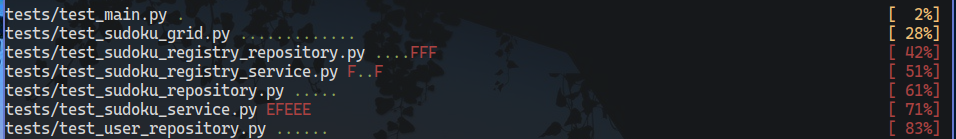
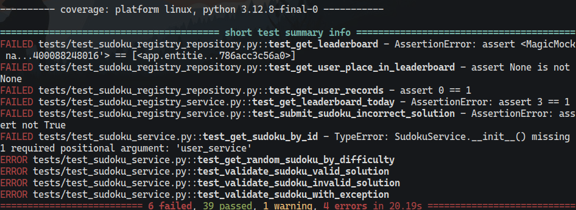
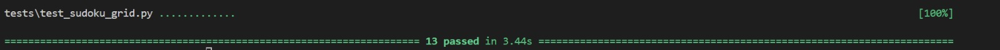
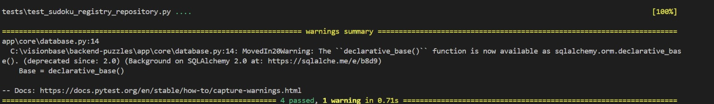
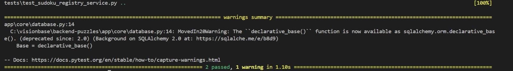
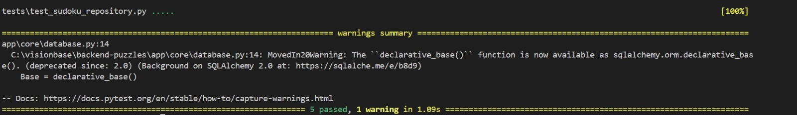
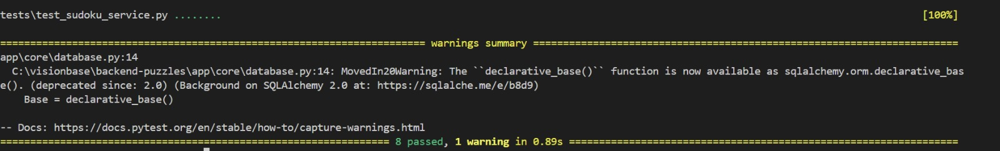
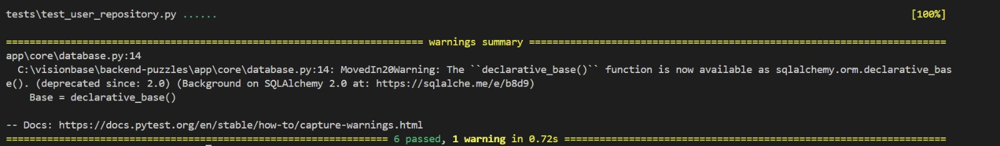
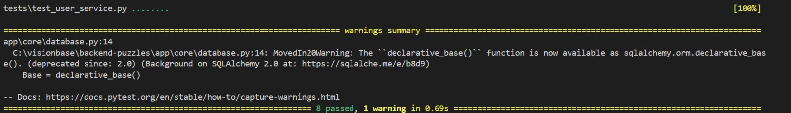

# Test Specification Document

## Introduction

### Goal

The goal of our testing is to ensure that our Puzzles website functions correctly, reliably, and securely, meeting both user expectations and project requirements. Through testing, we aim to identify and eliminate potential issues in functionality and usability before deploying the system to users.

Our testing strategy includes both black-box testing and white-box testing. Black-box testing focuses on validating the system’s behavior by testing inputs and outputs against expected results without considering the internal code structure. White-box testing, on the other hand, involves examining the internal logic, structure, and individual components of the code to verify their correctness and robustness.

By adopting a systematic and comprehensive testing process, we aim to deliver a high-quality product that is reliable under all expected conditions.

### Contents and Organization
The document is structured as follows:
- Test Plan: Outline the overall strategy, subjects and methods used for testing
- Test Results: Results and analysis of information gathered from our tests

## Test Plan

### Testing Strategy

#### Unit Testing

We use pytest for unit testing, focusing on individual components like functions, methods, and classes to ensure they behave correctly. Unit tests are written for several different modules to check logic, edge cases, and proper error handling.

#### Integration Testing

We follow a bottom-up approach to integration testing, starting with lower-level services and building upwards. This ensures smooth interaction between modules, such as the correct flow of data between backend services and the database, and proper API communication.

#### System Testing

For system testing, we use both the black box and white box testing methods. We validate that the website produces correct outputs based on specified inputs and handles edge cases appropriately.

## Test Subjects
### Frontend Testing Subjects

- Ensure that the landing page loads correctly and is responsive on various devices.
- Validate that users can log in using their email addresses and using Google and appropriate error messages are shown for invalid credentials.
- Test the interface for selecting puzzles, displaying puzzle data, and interacting with the solution input.
- Ensure the system accurately accepts or rejects solutions, and provides appropriate feedback.
- Test that leaderboard data is displayed correctly after updates to the table.
- Ensure users can view their profile details.

### Backend Testing Subjects

- Ensure that the user registration, login, and authentication flow works correctly with the Firebase Authentication service.
- Validate the correct storage of user data after successful registration (e.g., name, email, password hash).
- Check that invalid credentials are properly rejected.
- Test user data retrieval to ensure correct information is returned.
- Ensure that generating, solving and cathegorizing puzzles generates proper results and does not cause high stress on the machine.
- Ensure puzzle data is correctly stored for each puzzle after populating the database.
- Ensure that puzzles are fetched correctly based on user selection (e.g., easy, medium, hard).
- Ensure that puzzle completion recordfs are updated correctly in the database.
- Validate that the leaderboard correctly updates when a new puzzle is solved and that rankings are recalculated based on new completion times.

### Black Box Testing – Equivalence Partitioning

For black box testing, we will partition valid and invalid input values into equivalence classes. Here’s how we can define test cases based on the components in your system:
Test Case Table
Test Case ID	Description	Test Input	Expected Output	Mapped Use Case
TC1	Test User Registration with valid data	Valid name, email (e.g., user@example.com), password (e.g., password123)	Success message (e.g., "Registration successful")	User Registration
TC2	Test User Registration with invalid email format	Valid name, invalid email (e.g., user@com), valid password	Error message (e.g., "Invalid email format")	User Registration
TC3	Test User Registration with missing password	Valid name, valid email (e.g., user@example.com), empty password	Error message (e.g., "Password is required")	User Registration
TC4	Test Puzzle Fetching with valid puzzle ID	Valid puzzle ID (e.g., puzzle_01)	Puzzle data (e.g., {"id": "puzzle_01", "name": "Easy Puzzle", "difficulty": "easy"})	Puzzle Solving
TC5	Test Puzzle Fetching with invalid puzzle ID	Invalid puzzle ID (e.g., invalid_puzzle_123)	Error message (e.g., "Puzzle not found")	Puzzle Solving
TC6	Test Puzzle Submission with correct solution	Correct puzzle ID, solution within time limit	Success message (e.g., "Puzzle completed successfully")	Puzzle Solving
TC7	Test Puzzle Submission with incorrect solution	Correct puzzle ID, incorrect solution	Error message (e.g., "Incorrect solution")	Puzzle Solving
TC8	Test Leaderboard retrieval with valid puzzle difficulty	Difficulty level (e.g., "easy")	JSON leaderboard data (e.g., {"rank": 1, "user": "user1", "time": "2:00"})	Viewing the Leaderboard
TC9	Test Leaderboard retrieval with invalid difficulty level	Invalid difficulty level (e.g., "extreme")	Error message (e.g., "Invalid difficulty level")	Viewing the Leaderboard
TC10	Test User Login with valid credentials	Valid email, valid password	Success message (e.g., "Login successful")	User Registration (Login)
TC11	Test User Login with incorrect password	Valid email, incorrect password	Error message (e.g., "Invalid credentials")	User Registration (Login)
Equivalence Classes:

    Valid Equivalence Classes:
        For User Registration: Valid email (correct format), password length (minimum 6 characters), non-empty username.
        For Puzzle Solving: Valid puzzle ID, valid time limits, correct solution format.
        For Leaderboard Retrieval: Valid difficulty level ("easy", "medium", "hard").

    Invalid Equivalence Classes:
        For User Registration: Invalid email format, missing required fields (e.g., password), password too short.
        For Puzzle Solving: Invalid puzzle ID, invalid solution format, solution not within allowed time.
        For Leaderboard Retrieval: Invalid difficulty level ("extreme", "unknown").

### White Box Testing

White box testing requires us to understand the structure of the source code (including modules, functions, and classes) and list the corresponding unit tests, mocks, and tools.

#### Backend Source Code Structure

    Modules:
            User Service: Handles user saving to database, user profile updates and syncing with Firebase.
            Sudoku Service: Manages puzzle data fetching and validation.
            Sudoku Registry Service: Manages solved sudoku records and leaderboard data fetching.
            Email Util: Helper for sending emails to users
        Database: Manages storage and retrieval of user data, puzzles, and leaderboard entries.
    Functions:
        SudokuService:
            get_random_sudoku_by_difficulty(): Gets a random sudoku by difficulty from the database
            get_sudoku_by_id(): Gets a sudoku by id from the database
            populate_sudoku_registry(): Populates the sudoku database
            validate_sudoku(): Validates if a sudoku is solved
        SudokuRegsitryService:
            get_leaderboard_today(): Gets today's leaderboard
            get_leaderboard_week(): Gets week's leaderboard
            get_leaderboard_month(): Gets month's leaderboard
            get_leaderboard_all_time(): Gets all time's leaderboard
            get_leaderboard(): Gets a leaderboard by difficulty and optional beginning time
        UserService:
            getUserByFirebaseId(): Gets user by associated Firebase id
            createUser(): Creates user with associated Firebase id in the database
            updateUser(): Updates user with associated Firebase id in the database
            am_i_admin(): Checks if user with associated Firebase id is an admin

#### Required Mocks
Database Mocks: For simulating puzzle data retrieval during tests.

#### Testing Tools
pytest & pytest-cov: For unit testing individual functions and modules. And coverage reporting.

## Test Results
### Analysis
Coverage report generated by pytest module (with the pytest-cov plugin).

### Logs
Unit test logs generated by the pytest module.

